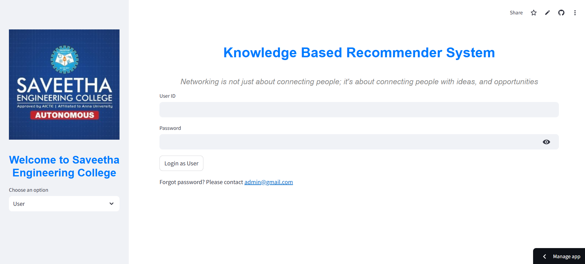

## Knowledge Based Recommender System Using Artificial Intelligence For Smart Education

## About
Oue Recommender system is designed to foster meaningful connections among students based on shared academic interests and goals. Using advanced machine learning algorithms, the system matches like-minded individuals, enabling collaborative learning and idea sharing..

## Features

- User Friendly Ui using streamlit.
- Database which ensures integrity.
- Uses light weight dtabase.
- Combines content based and collaborative based filtering techniquesx.

## Requirements

* Operating System: Requires a 64-bit OS (Windows 10 or Ubuntu) for compatibility with deep learning frameworks.
* Development Environment: Streamlit Python 3.6 or later is necessary 
* Machine Learning Frameworks: TensorFlow for NLP techniques
* Version Control: Implementation of Git for collaborative development and effective code management.
* IDE: Use of VSCode as the Integrated Development Environment for coding, debugging, and version control integration.
* Additional Dependencies: Includes scikit-learn, TensorFlow (versions 2.4.1),pandas for data handling

## System Architecture

## Output

#### Output1 - Login Page of the proposed model

#### Output2 - Connected users based on appropriate interest

## Results and Impact
In conclusion, the project successfully developed a dynamic connecting system tailored for students, facilitating connections based on shared interests and academic goals.
This project serves as a foundation for future developments in assistive technologies and contributes to creating a more inclusive and accessible digital environment.

## Articles published / References
Zayed, Y.; Salman, Y.; Hasasneh, A. A Recommendation System for Selecting the Appropriate Undergraduate Program at Higher Education Institutions Using Graduate Student Data. Appl. Sci. 2021, 12, 12525

